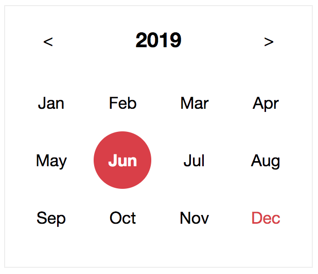
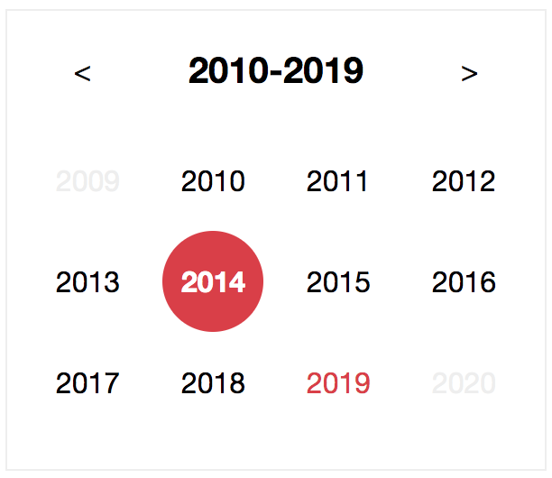
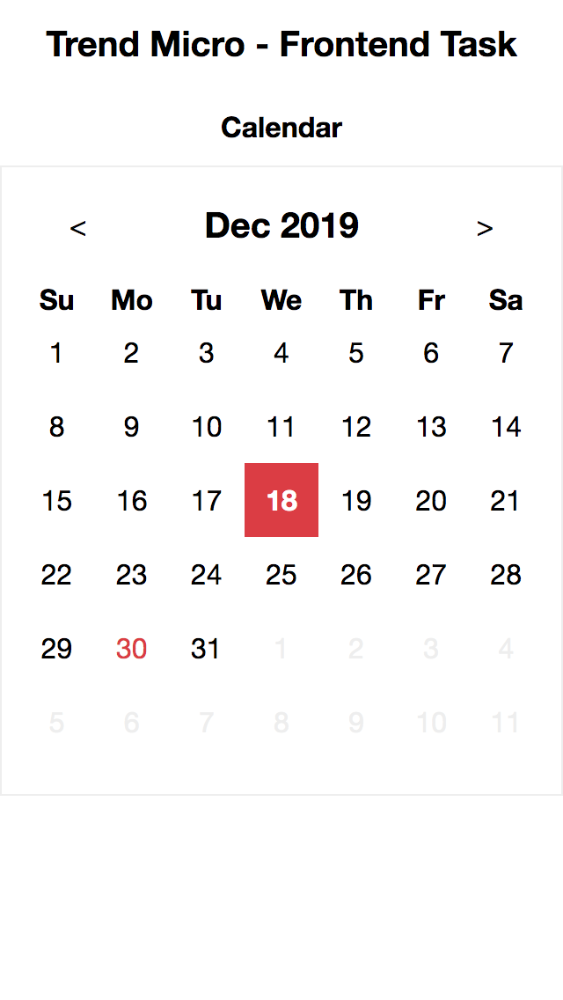
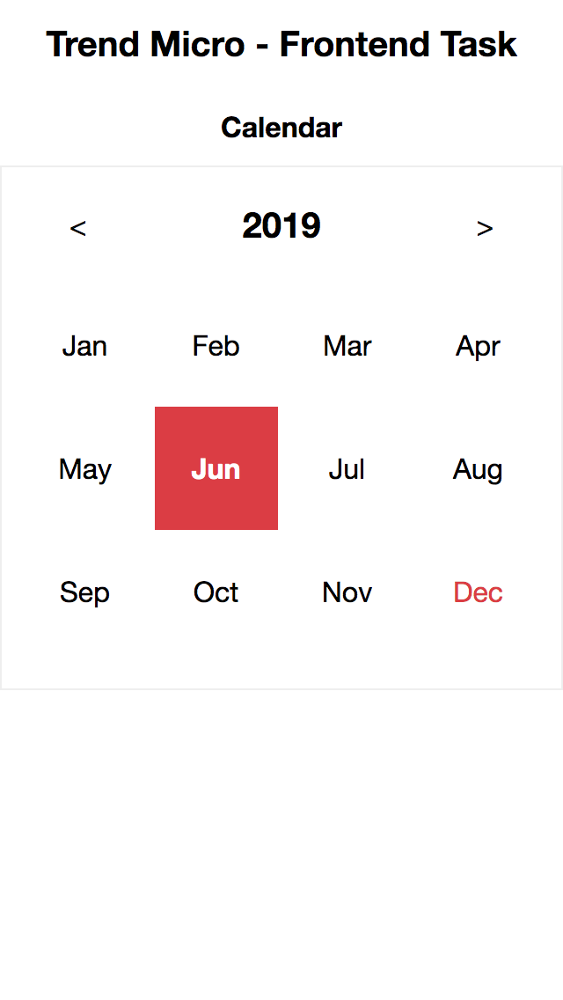
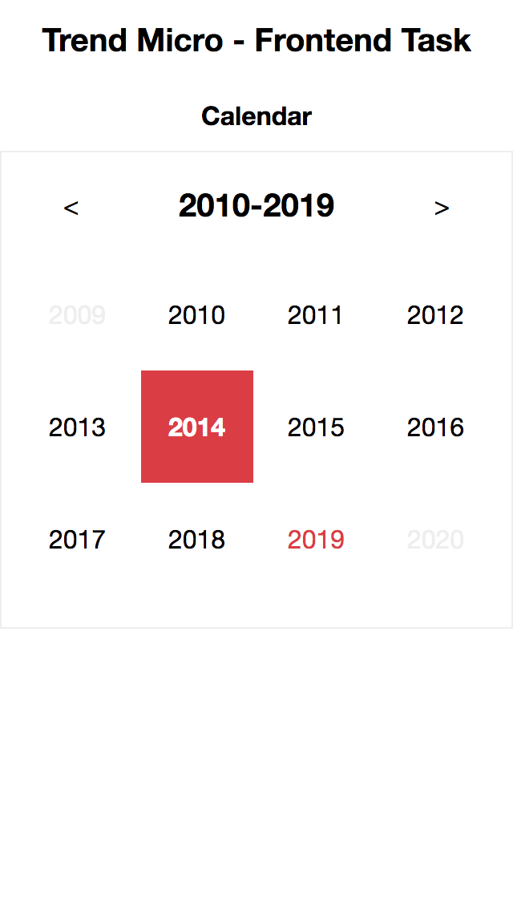

# Trend Micro Frontend Task - Calendar

## Preview

|        |                         DateView                         |                         MonthView                         |                         YearView                         |
| :----: | :------------------------------------------------------: | :-------------------------------------------------------: | :------------------------------------------------------: |
|   PC   |         |         |         |
| Mobile |  |  |  |

## Description

The `<Calendar>` component can be divided to two parts, logic and views.

### Logic

- CalendarLogic

### Views

- DateView
- MonthView
- YearView

## Installation

```
yarn
```

## Run in development mode

### Demo page

```
yarn start
```

And go to [`http://localhost:3000`](http://localhost:3000).

### Styleguide

You can develop components in the styleguide page and preview in the real time.

```
yarn styleguide
```

And go to [`http://localhost:6060`](http://localhost:6060).

## Production build

### Demo page

```
yarn buid
```

### Styleguide

```
yarn styleguide:build
```
