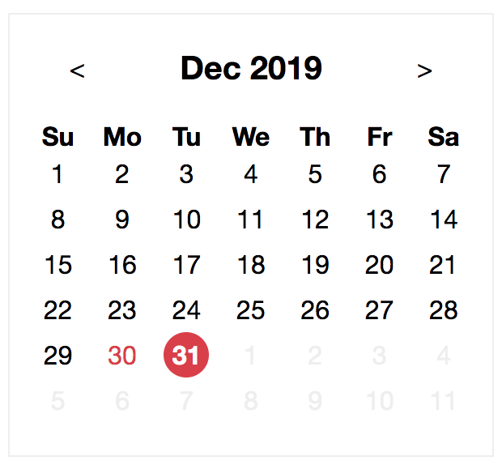

# Trend Micro Frontend Task - Calendar

## Preview

|        |                         DateView                         |                         MonthView                         |                         YearView                         |
| :----: | :------------------------------------------------------: | :-------------------------------------------------------: | :------------------------------------------------------: |
|   PC   |         |         |         |
| Mobile |  |  |  |

## Installation

```
yarn
```

## Run in development mode

### Demo page

```
yarn start
```

And go to [`http://localhost:3000`](http://localhost:3000).

### Styleguide

You can develop components in the styleguide page and preview in the real time.

```
yarn styleguide
```

And go to [`http://localhost:6060`](http://localhost:6060).

## Production build

### Demo page

```
yarn buid
```

### Styleguide

```
yarn styleguide:build
```

## Description

### Overview

The `<Calendar>` component can be divided to two parts, logic and views.

#### Logic

- CalendarLogic

#### Views

- DateView
- MonthView
- YearView

### Idea


The idea of implementation comes from the FSM (finite-state machine) and [`xstate`](https://xstate.js.org/). I implemented the basic version of FSM by creating a reducer with the two level `switch - case` The outer `switch - case` checks the current state (view) and the inner `switch - case` handles the real events. The following is an example.

```js
function reducer(state, event) {
  const { status, context } = state

  switch (status) {
    case stateTypes.dateView: {
      switch (event.type) {
        case eventTypes.SELECT_DATE:
          return {
            status: stateTypes.dateView,
            context: actions.selectDate(context, event),
          }
        case eventTypes.GO_MONTH_VIEW:
          return {
            status: stateTypes.monthView,
            context: actions.recalculateNodes(context, {
              ...event,
              status: stateTypes.monthView,
            }),
          }
        default:
          return state
      }
    }

    case stateTypes.monthView: {
      switch (event.type) {
        case eventTypes.SELECT_MONTH:
          return {
            status: stateTypes.dateView,
            context: actions.selectMonth(context, event),
          }
        case eventTypes.GO_YEAR_VIEW:
          return {
            status: stateTypes.yearView,
            context: actions.recalculateNodes(context, {
              ...event,
              status: stateTypes.yearView,
            }),
          }
        default:
          return state
      }
    }

    case stateTypes.yearView: {
      switch (event.type) {
        case eventTypes.SELECT_YEAR:
          return {
            status: stateTypes.monthView,
            context: actions.selectYear(context, event),
          }
        case eventTypes.GO_DATE_VIEW:
          return {
            status: stateTypes.dateView,
            context: actions.recalculateNodes(context, {
              ...event,
              status: stateTypes.dateView,
            }),
          }
        default:
          return state
      }
    }

    default:
      return state
  }
}
```
